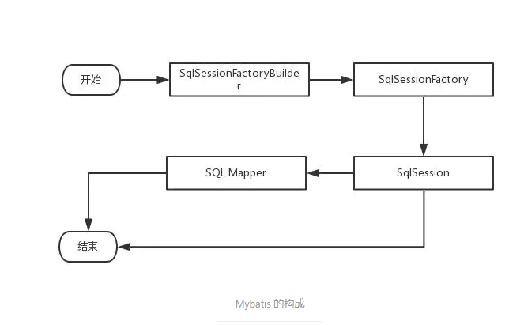
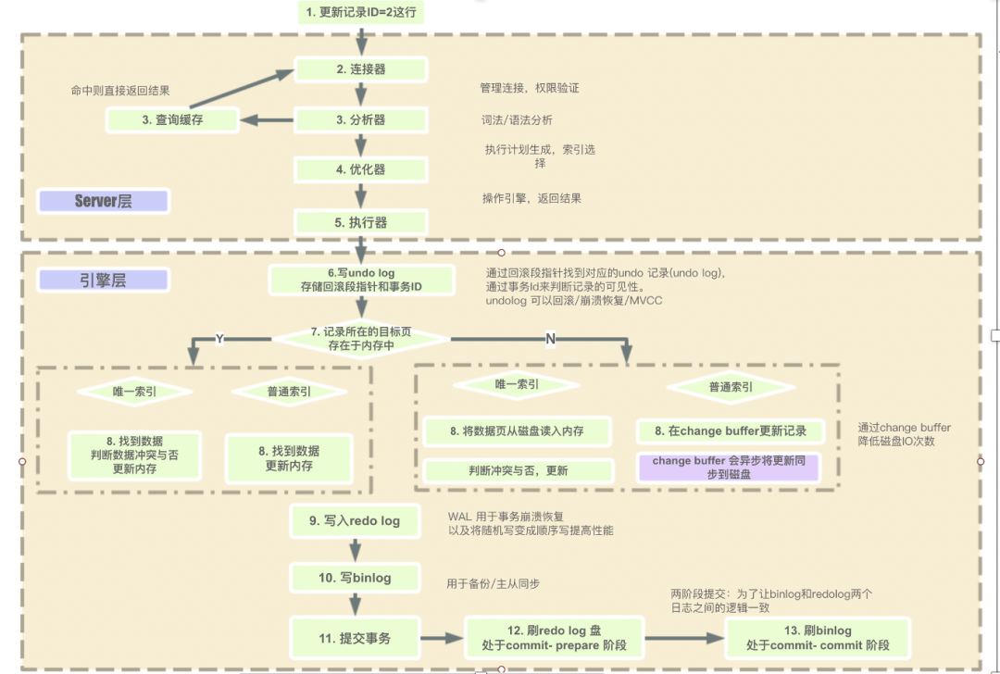

## Mybatis

**MyBatis组件以及执行基本流程**

- SqlSessionFactoryBuilder（构造器）:它会根据配置信息或者代码生成SqlSessionFactory（工厂接口）
- SqlSessionFactory：依靠工厂来生成SqlSession。
- SqlSession：是一个既可以发送SQL去执行并返回结果的，也可以获取Mapper接口，通过Mapper接口查询并封装数据。
- SQL Mapper:它是MyBatis新设计的组件，它是由一个Java接口和XML文件（或者注解)构成的，需要给出对应的SQL和映射规则。它负责发送SQL去执行，并返回结果。

**MySQL 执行一条语句的内部执行过程**

* 客户端先通过连接器连接到 MySQL 服务器
* 连接器权限验证通过之后，先查询是否有查询缓存，如果有缓存（之前执行过此语句）则直接返回缓存数据，如果没有缓存则进入分析器。
* 分析器会对查询语句进行语法分析和词法分析，判断 SQL 语法是否正确，如果查询语法错误会直接返回给客户端错误信息，如果语法正确则进入
  优化器
* 优化器是对查询语句进行优化处理
* 优化器执行完就进入执行器，执行器就开始执行语句进行查询比对了，直到查询到满足条件的所有数据，然后进行返回

`图解`

